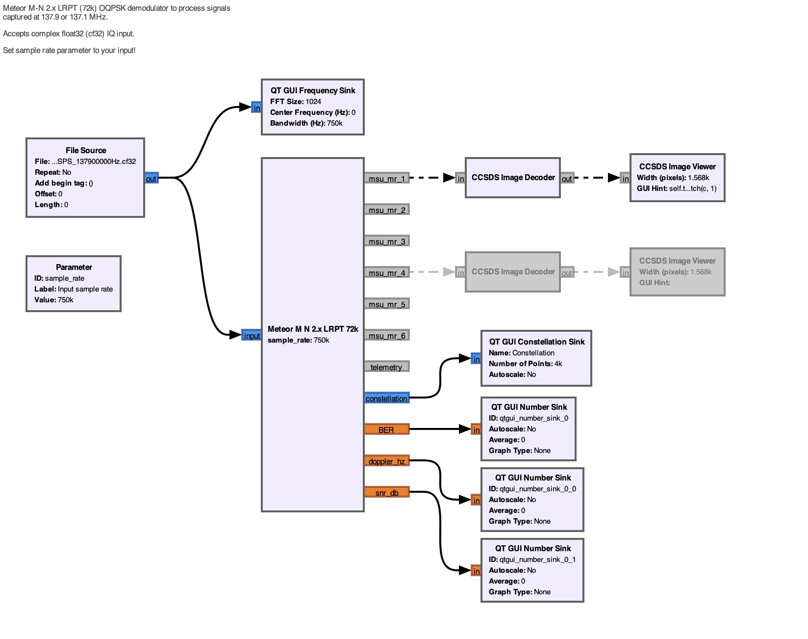
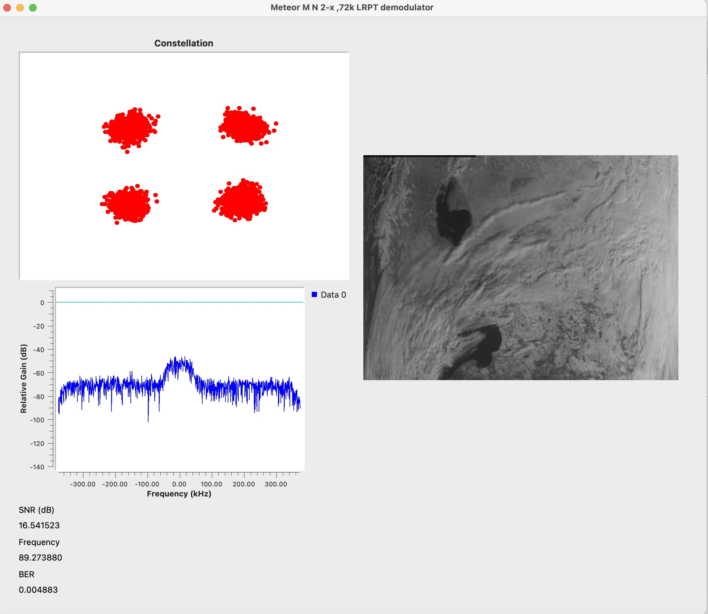

# GNU flowgraphs for Meteor M-N2.x LRPT

The project is using blocks from gr-satellites, follow the installation here.

https://gr-satellites.readthedocs.io/en/latest/installation_intro.html

I wanted to learn about OPQSK demodulation and picked Meteor M-N2.x LRPT as target. This series of the Meteor satellites has two active members as of 2026. Meteor M N2-3 and Meteor M N2-4. 

The project is organized into smaller GNU radio hier blocks (files with .grc and a matching .py and block.yml) and OOT modules (files without .grc).

# Usage


Open gnuradio-companion with 

```bash
GRC_HIER_PATH=./meteor GRC_BLOCKS_PATH=. gnuradio-companion
```

The main entry point for demonstration is meteor_demo.grc.

You will need a cf32 input file. These can be created using [Satdump](https://github.com/SatDump/SatDump)'s Recording
features. The file name has the format of

```
<datetime>_<sps>SPS_<frequency>.cf32
```

For example
```
2026-02-13_07-39-09_256000SPS_137900000Hz.cf32
```

Select the input file in the flowgraph, and set the sample rate parameter to
your sps (e.g. 256000). Then click the play button.




If things go well you should see something like this.

The LRPT downlink uses 3 channels out of 6, as of this writing channels 1, 2 and 4 are active, you can connect a CCSDS Image decoder to them.

I was greatly inspired by how Satdump implements the protocol, and tried reimplement its metrics as well, these are exposed as 'doppler hz' from the costas loop, 'SNR (db)' from soft symbols and 'BER' from the viterbi stage. 

It's worth checking out the OQPSK demodulator pipeline as well, which is a 1-1 reimplementation of what Satdump does, only in GNU radio terms. I tried to trim it down to only this version of Meteor, since the original one supports the previous generation as well. 

My implementation doesn't work with 80k samples, only the 72k line is implemented.

The later stages follow the descriptions found in http://jmfriedt.free.fr/glmf_meteor_eng.pdf.

I also used https://github.com/Digitelektro/MeteorDemod for inspiration. I think the jpg decoder part is ported from there.

I might want to get rid of the gr-satellites dependency later, but it comes with a proper reed-solomon decoder as a wrapper around [libfec](https://github.com/daniestevez/gr-satellites/tree/1358c09ee1924b2c407ddc60859ea083add925d8/lib/libfec). It would be hard to port this to python, but we will see.

## Known issues

I still need to implement rotation check. If the signal gets locked at PI/2 or 3/2 * Pi, the Viterbi algorithm will not work and no meaningful data comes out of the pipeline. 
